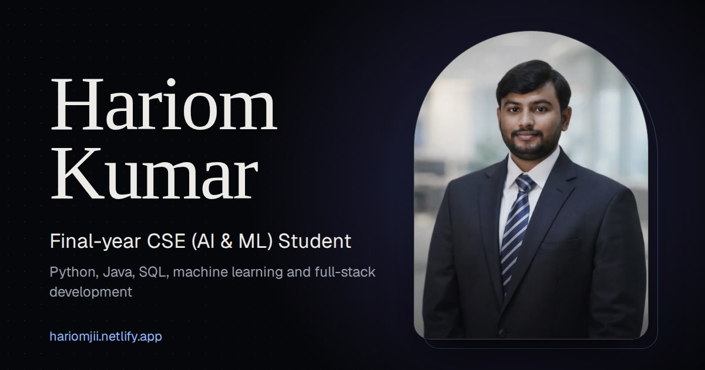

# Hariom Kumar: 3D Portfolio

A dark, cinematic personal portfolio for **Hariom Kumar**, a final-year B.Tech CSE (AI & ML) student at Galgotias University. It turns a traditional resume into an interactive 3D website while keeping every detail easy to find.

**Live site: [hariomjii.netlify.app](https://hariomjii.netlify.app)**



## What's on the site

- **Hero:** portrait, title, short introduction, "View My Work" and "Download Resume" buttons
- **About:** background, interests, professional focus, foundations and strengths
- **Experience:** Infosys internship shown on a scroll-drawn timeline
- **Projects:** five projects, with filters for AI & ML and Full-stack, live demo and GitHub links, and expandable details
- **Skills:** grouped as Programming Languages, CS Fundamentals, AI & Machine Learning, Web Technologies, Database Systems and Soft Skills
- **Education and Certifications:** B.Tech, Intermediate, High School, and five certifications and assessments
- **Contact:** email, LinkedIn, GitHub and LeetCode, plus a resume download

All content comes from Hariom's resume and his GitHub project READMEs. Nothing is invented.

## Built with

| Area | Tools |
| --- | --- |
| Framework | React 19, TypeScript, Vite |
| Styling | Tailwind CSS v4 |
| 3D | Three.js with React Three Fiber |
| Animation | Framer Motion |
| Fonts | Instrument Serif and Geist, self-hosted through Fontsource |
| Hosting | Netlify |

## Design and performance notes

- One fixed WebGL scene sits behind the page. The camera moves down as you scroll and leans toward the cursor, and a low-poly crystal changes position for each section.
- Three.js loads as a separate chunk once the browser is idle, so text and the photo appear first.
- Fewer particles, a lower pixel ratio and no pointer effects on phones, plus an automatic pixel-ratio drop if the frame rate falls.
- Respects `prefers-reduced-motion`: the intro, tilt, magnetic buttons and camera movement are switched off.
- Works without WebGL. The 3D layer is skipped and the page still shows all content.
- Accessible: skip link, landmarks, visible focus rings, keyboard-friendly menu and project details, and alt text.
- SEO: page title, description, Open Graph tags and JSON-LD `Person` data.

## Run it locally

You need [Node.js](https://nodejs.org) 20 or newer.

```bash
git clone https://github.com/Hariomxlx/Hariom_portfolio-.git
cd Hariom_portfolio-
npm install
npm run dev        # opens at http://localhost:5173
```

Other commands:

```bash
npm run build      # type-checks, then writes the site to ./dist
npm run preview    # serves ./dist locally
```

## Project structure

```
src/
  data/resume.ts        all content: text, dates, links, projects, skills
  sections/             Hero, About, Experience, Projects, Skills, Education, Certifications, Contact
  components/           Navbar, Preloader, MagneticButton, TiltCard, Reveal, Section, Icons
  components/three/     Scene, CameraRig, Particles, Crystal, Floor
  lib/motionSync.ts     scroll and pointer state shared with the 3D scene
public/
  Hariom_Kumar_Resume.pdf   the downloadable resume
  images/                   portrait and share preview
```

## Update the content

Everything on the site is in **`src/data/resume.ts`**.

- **Add a project:** copy one object in the `projects` list and edit it. `category` is `'ai-ml'` or `'full-stack'`, `demo` is optional, and `preview` is a `{ kind: 'stack', label, layers }` diagram with up to three layers.
- **Update the resume:** replace `public/Hariom_Kumar_Resume.pdf`, keeping the file name.
- **Hide the phone number:** set `showPhone: false` in the same file.

## Deploy

Run `npm run build` and upload the `dist` folder to any static host such as Netlify, Vercel or Cloudflare Pages. Asset paths are relative, so it also works from a sub-path.

For link previews on LinkedIn and WhatsApp, `og:image` in `index.html` must be the full address of the image, for example `https://hariomjii.netlify.app/images/og-image.jpg`.

## Contact

- Email: [hariomkumarnke25@gmail.com](mailto:hariomkumarnke25@gmail.com)
- LinkedIn: [hariom-kumar-68b82b2ab](https://www.linkedin.com/in/hariom-kumar-68b82b2ab)
- GitHub: [Hariomxlx](https://github.com/Hariomxlx)
- LeetCode: [Hariom49](https://leetcode.com/u/Hariom49/)
